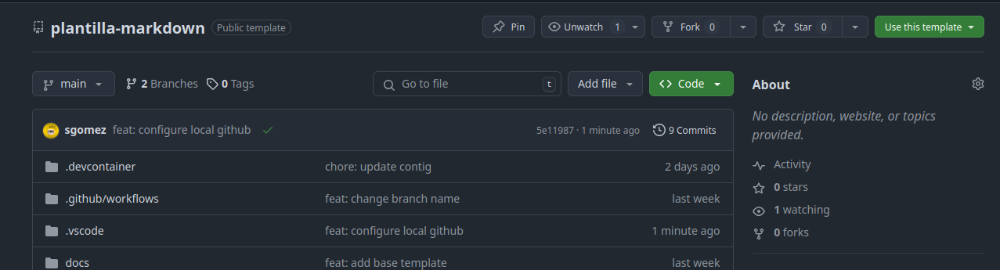
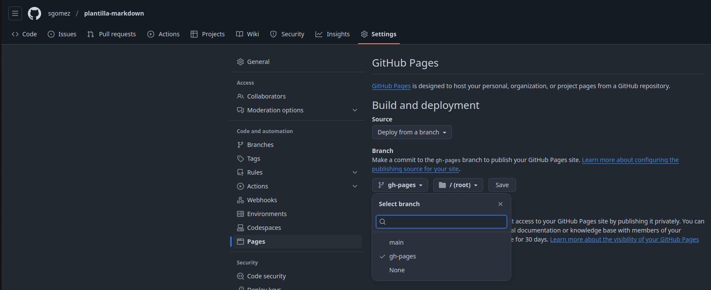

# Plantilla de markdown

## Como usar esta plantilla

### Paso 1

Pulsa sobre el boton "Usar esta plantilla" que veras en el repositorio:



crea el repositorio con este nombre: `introduccion-a-markdown`.

### Paso 2

Abre vscode y selecciona la opción: `Clonar repositorio de Git`

### Paso 3

En tu copia, edita el fichero `mkdocs.yml` y cambia la linea 2. Donde pone:

```
site_url: https://sgomez.github.io/plantilla-de-markdown/
```

Cambia a:

```
site_url: https://<tu usuario de github>.github.io/introduccion-a-markdown/
```

## Como publicar

Abrir la configuración de vuestro repositorio, allí buscar la opción `Páginas` y
en ramas, seleccionar la opción `gh-pages`.



Pasados unos minutos, al recargar la página nos dirá que la web está disponible
y nos indicará con un enlace como acceder a ella.

## Referencias

- https://squidfunk.github.io/mkdocs-material/reference/
